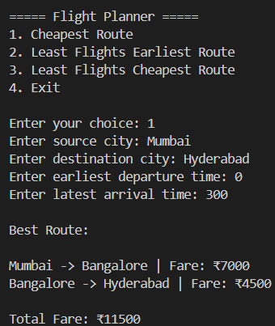
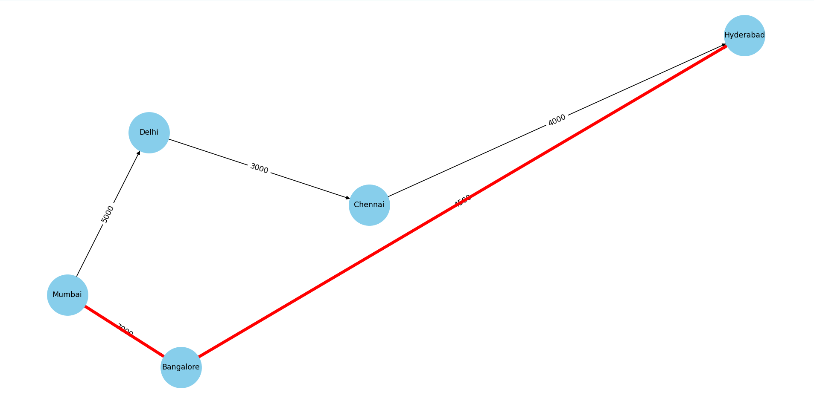

# Intelligent Flight Route Optimization System

## Overview

The Intelligent Flight Route Optimization System is a Python-based application that helps users find optimal flight routes between cities using graph algorithms and route optimization techniques.

The project models flights as a directed graph where:

* Cities are represented as nodes
* Flights are represented as weighted edges

Users can search for:

* Cheapest routes
* Routes with the least number of flights
* Least flights + cheapest combined routes

The system also includes route visualization using NetworkX and Matplotlib.

---

## Features

* Dynamic flight dataset using CSV files
* Interactive Command Line Interface (CLI)
* Cheapest route calculation
* Least flights earliest-arrival optimization
* Least flights cheapest-fare optimization
* Graph-based route visualization
* Directed weighted graph implementation
* Custom Queue and Heap data structures
* Real-world city and airline dataset

---

## Algorithms Used

### Graph Algorithms

* Breadth First Search (BFS)
* Priority Queue based route optimization

### Data Structures

* Graph (Adjacency List)
* Queue (Linked List Implementation)
* Min Heap / Priority Queue

### Optimization Strategies

* Cheapest Path
* Earliest Arrival Path
* Minimum Flight Path

---

## Tech Stack

* Python
* Pandas
* NetworkX
* Matplotlib

---

## Project Structure

```bash
flight-planner/
│
├── data/
│   └── flights.csv
│
├── visualization/
│   └── graph_visualizer.py
│
├── screenshots/
│
├── flight.py
├── planner.py
├── main.py
└── README.md
```

---

## Sample Dataset

The project uses a CSV-based flight dataset containing:

* Flight numbers
* Source and destination cities
* Departure and arrival times
* Fare information
* Airline names

---

## Route Visualization

The application visualizes:

* Cities as graph nodes
* Flights as directed edges
* Optimal routes highlighted in red

---

## Screenshots

### CLI Output



### Route Visualization



---

## How to Run

### 1. Clone Repository

```bash
git clone <your-repository-link>
```

### 2. Install Dependencies

```bash
pip install pandas networkx matplotlib
```

### 3. Run Application

```bash
python main.py
```

---

## Example Usage

```text
1. Cheapest Route
2. Least Flights Earliest Route
3. Least Flights Cheapest Route
4. Exit
```

Example Input:

```text
Source City: Mumbai
Destination City: Hyderabad
```

---

## Future Improvements

* Streamlit-based web application
* Real-time flight API integration
* Flight delay prediction using Machine Learning
* Airline filtering
* Multi-city trip planning
* A* shortest path optimization
* Authentication system

---

## Learning Outcomes

Through this project, I gained experience with:

* Graph-based problem solving
* Pathfinding algorithms
* Data structures implementation
* CSV data processing
* Visualization libraries
* Modular software design

---

## Author

Prathiv V
